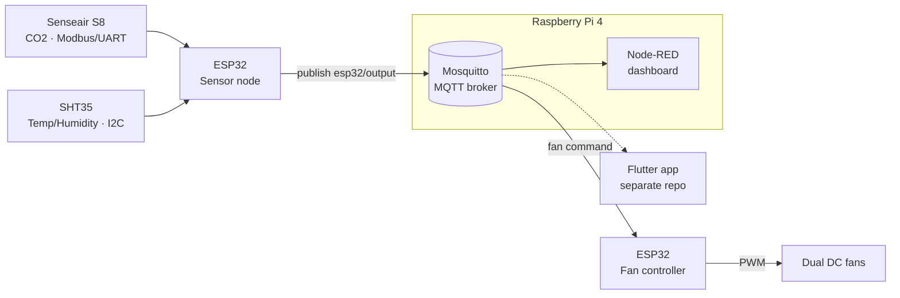

# Smart Classroom — MQTT IoT (ESP32 + Raspberry Pi)

A closed-loop air-quality system for a classroom: an **ESP32 edge node** reads CO2,
temperature and humidity, publishes them over **MQTT**, and automatically drives ventilation
fans based on the CO2 level. A **Raspberry Pi** runs the MQTT broker (Mosquitto) and a
**Node-RED** dashboard; a separate Flutter app provides the mobile UI.

> Originally built as an undergraduate special-topic project, restructured and documented as
> a portfolio piece.

## What this project demonstrates

- **MQTT pub/sub** messaging between distributed edge nodes and a broker.
- **Modbus RTU over UART** — reading a Senseair S8 CO2 sensor at the register level
  (request framing + CRC-16 validation).
- **I2C sensor integration** — SHT35 temperature/humidity via a driver library.
- **Closed-loop control** — CO2 concentration mapped to a fan-speed command and actuated
  with PWM motor control on a second ESP32.
- **A small custom wire protocol** with a documented [spec](docs/protocol.md).

## Architecture



All nodes publish and subscribe on a single topic, **`esp32/output`**, using a CSV-style
frame (`0x55, <id>, <type>, <value>, 0xED`). See [docs/protocol.md](docs/protocol.md).

## Repository layout

```
firmware/
  sensor-node/        ESP32 sketch: S8 + SHT35 -> MQTT, CO2 -> fan command
  fan-controller/     ESP32 sketch: MQTT/UART -> dual PWM motor control
node-red/
  functions/          Node-RED function nodes that parse each frame type
  flows/              (export your flows.json here — see node-red/flows/README.md)
docs/
  architecture.md     data flow and components
  protocol.md         the wire-protocol specification
  hardware.md         sensors, pinout, wiring
```

## Hardware

| Role           | Part                | Interface                       |
|----------------|---------------------|---------------------------------|
| MCU (x2)       | ESP32 dev board     | WiFi                            |
| CO2            | Senseair S8         | Modbus RTU, UART2 (GPIO16/17) @ 9600 |
| Temp/Humidity  | Sensirion SHT35     | I2C (GPIO21/22), addr 0x44      |
| Actuator       | 2× DC fan motors    | PWM (GPIO26/27)                 |
| Broker / UI    | Raspberry Pi 4      | Mosquitto + Node-RED            |

Full pinout and wiring notes in [docs/hardware.md](docs/hardware.md).

## Build & flash

1. Install the Arduino IDE (or PlatformIO) with ESP32 board support.
2. Install libraries: `PubSubClient`, `ArtronShop_SHT3x`, and an `analogWrite` shim for ESP32.
3. In each sketch folder (`firmware/sensor-node/`, `firmware/fan-controller/`), copy
   `secrets.example.h` to `secrets.h` and fill in your WiFi/MQTT settings.
4. Open the `.ino`, select your ESP32 board, and upload.

Secrets (`secrets.h`) are git-ignored and never committed.

> Security note: an earlier commit in this repo's history contained a hard-coded broker
> password. That credential has been invalidated and the code now loads all credentials from
> the git-ignored `secrets.h`.
