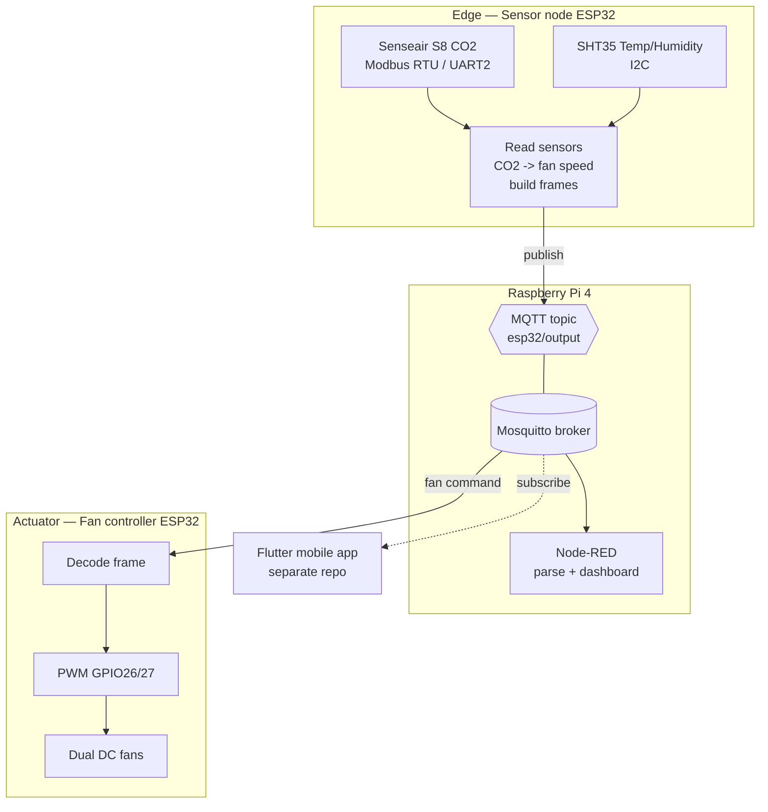

# Architecture

## Overview

The system is split into independent nodes that communicate only through the MQTT broker. This
keeps the edge firmware simple and lets the UI layers (Node-RED, Flutter) evolve separately.

## Data flow

1. The **sensor node** polls the S8 (CO2) and SHT35 (temp/humidity) every ~2 s.
2. It publishes one frame per reading to `esp32/output`, and computes a fan-speed command
   from the CO2 level, publishing it **only when the level changes**.
3. **Mosquitto** on the Raspberry Pi distributes messages to all subscribers.
4. **Node-RED** function nodes parse each frame type (see `node-red/functions/`) and feed a
   dashboard.
5. The **fan controller** ESP32 subscribes to the topic, decodes fan commands, and drives the
   motors via PWM.
6. The **Flutter app** (in a separate repository) subscribes for a mobile view.

## Design notes

- **Single topic, typed frames.** All traffic shares one topic; the frame's `ID`/`TYPE`
  fields let each subscriber filter what it cares about. Simple to start, with room to evolve
  toward a topic-per-type / JSON payload scheme.
- **Decoupling.** The control law lives entirely on the sensor node; the fan controller is a
  thin actuator. Either side can be replaced without touching the other.
- **Stateless UI.** Node-RED and Flutter only read from the broker, so adding/removing a UI
  has no effect on the control loop.

See [protocol.md](protocol.md) for the exact frame format and [hardware.md](hardware.md) for
wiring.

